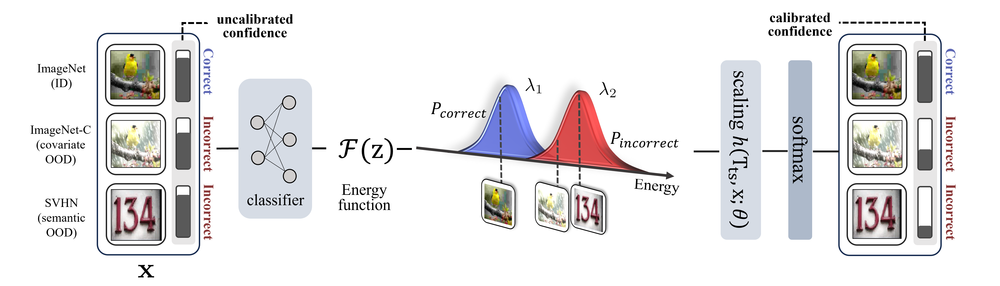

# [ECCV 2024] Uncertainty Calibration with Energy Based Instance-wise Scaling in the Wild Dataset
 > Official implementation of "Uncertainty Calibration with Energy Based Instance-wise Scaling in the Wild Dataset (ECCV '24)"
>[Mijoo Kim](https://sites.google.com/view/mijoo-kim/), and [Junseok Kwon](https://scholar.google.com/citations?user=lwsaTnEAAAAJ&hl=en)
 

**📢Code will be released soon !**

## Abstract

In this paper, we investigate robust post-hoc uncertainty calibration methods for DNNs within the context of multi-class classification tasks. While previous studies have made notable progress, they still face challenges in achieving robust calibration, particularly in scenarios involving out-of-distribution (OOD). We identify that previous methods lack adaptability to individual input data and struggle to accurately estimate uncertainty when processing inputs drawn from the wild dataset. To address this issue, we introduce a novel instance-wise calibration method based on an energy model. Our method incorporates energy scores instead of softmax confidence scores, allowing for adaptive consideration of DNN uncertainty for each prediction within a logit space.

